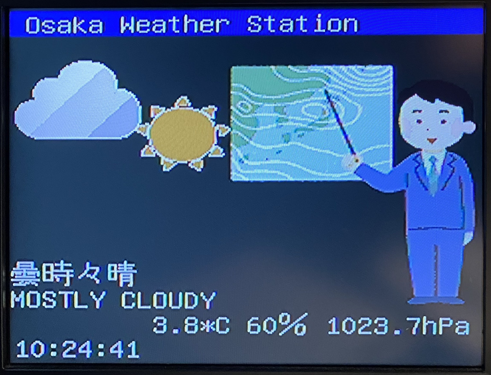

# ESP32_JMA_Weather-forecast Sample

## Overview

This sample code has the following features:

- By connecting ATOM Lite to the RCA connector (video input: NTSC) on a CRT or digital TV, ATOMLite can display weather information. The resolution of the video is 480i.
- ATOM Lite connects to the Internet via a WiFi access point.
- ATOM Lite accesses Thing Speak's channels to get temperature, humidity, and barometric pressure information.
- ATOM Lite displays the weather forecast for the day based on information from the unofficial JMA(Japan Meteorological Agency) forecast API.
- ATOM Lite displays the time synchronized with an NTP server.

## Acknowledgments

Thanks to the authors of these libraries.👍

- Thanks to [@Adafruit Industries](https://github.com/adafruit), author of the [Adafruit GFX](https://github.com/adafruit/Adafruit-GFX-Library) library.
- Thanks to [@Hieromon](https://github.com/Hieromon), author of the [AutoConnect](https://github.com/Hieromon/AutoConnect) library.
- Thanks to [@tanakamasayuki](https://github.com/tanakamasayuki), author of the [efont](https://github.com/tanakamasayuki/efont) library.
- Thanks to [@Roger-random](https://github.com/Roger-random), author of the [ESP_8_BIT_composite](https://github.com/Roger-random/ESP_8_BIT_composite) library.
- Thanks to [@bitbank2](https://github.com/bitbank2), author of the [AnimatedGIF](https://github.com/bitbank2/AnimatedGIF) library.
- Thanks to [@mathworks](https://github.com/mathworks), author of the [thingspeak-arduino](https://github.com/mathworks/thingspeak-arduino) library.
- THanks to [いらすとや](https://www.irasutoya.com/), author of the Illustration.
- Thanks to [気象庁 Japan Meteorological Agency](https://www.jma.go.jp/jma/), author of Unofficial JMA forecast API.
